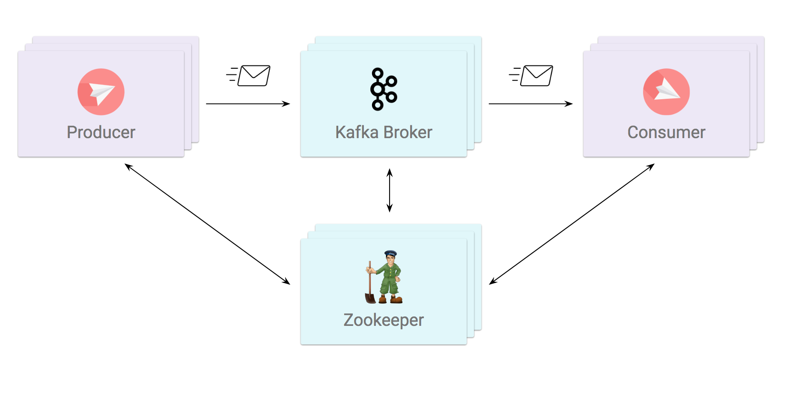
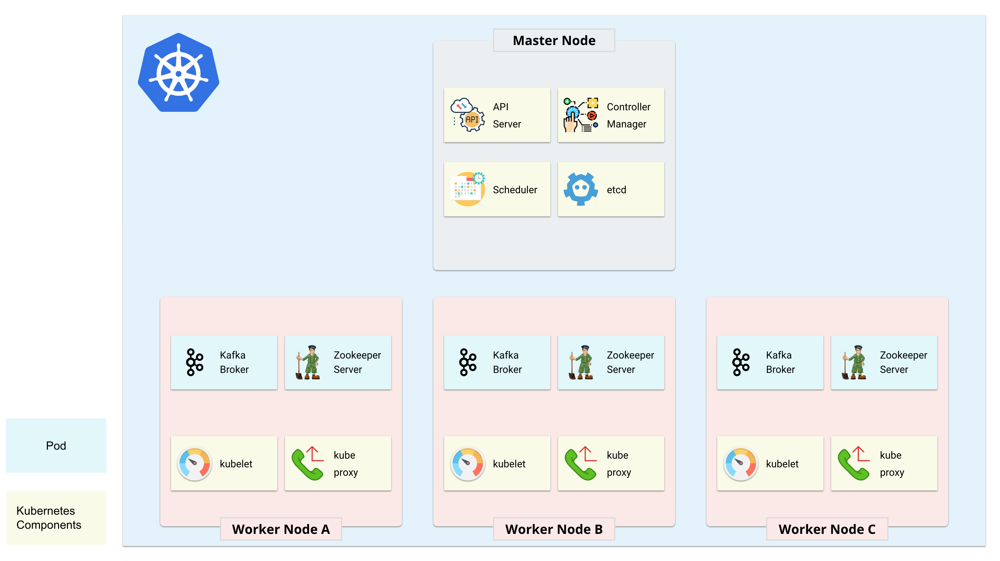

# Architecture

## Kafka

A Kafka cluster typically consists of multiple **brokers**. A producer can publish messages to a **topic**. A **producer** publishes messages to **topics** in **brokers**. A **consumer** can subscribe to one or more **topics** from the **brokers**, and consume the subscribed messages by pulling data from the **brokers**.

Kafka uses Zookeeper to store metadata about the cluster, as well as consumer client details. A Zookeeper cluster is called an **ensemble**. As long as a majority of the ensemble are up, the service will be available. Because Zookeeper requires a majority, it is best to use an odd number of servers. This means that in a three-node ensemble, you can run with one node missing. With a five-node ensemble, you can run with two nodes missing.

## Kafka On Kubernetes

There are various implementations of running Kafka on Kubernetes, mainly in 2 different approaches:

* [StatefulSet](https://kubernetes.io/docs/concepts/workloads/controllers/statefulset/)
* [Kubernetes Operators](https://coreos.com/operators/)

[StatefulSet](https://kubernetes.io/docs/concepts/workloads/controllers/statefulset/) is valuable for applications that require one or more of the following:

* Stable, unique network identifiers.
* Stable, persistent storage.
* Ordered, graceful deployment and scaling.
* Ordered, graceful deletion and termination.
* Ordered, automated rolling updates.

However, it is not designed to provide a general solution that works for all stateful applications, especially in terms of operations like scaling, upgrading, etc. For example, scaling in/out data stores such as Postgres, MySQL, Kafka, Cassandra, etc requires different series of operations that cannot be generalized into StatefulSet.

[Kubernetes Operators](https://coreos.com/operators/) are used to encode application domain knowledge and extend the Kubernetes API through the [Custom Resource Definitions](https://kubernetes.io/docs/concepts/extend-kubernetes/api-extension/custom-resources/)\(CRDs\) mechanism, enabling users to create, configure, and manage applications.

> Some of the implementations of Kubernetes Operators uses Pod directly while others may leverage StatefulSet inside Operators since StatefulSet only became GA in 1.9.

In either way, Kafka cluster and Zookeeper will be deployed across Kubernetes worker nodes.

