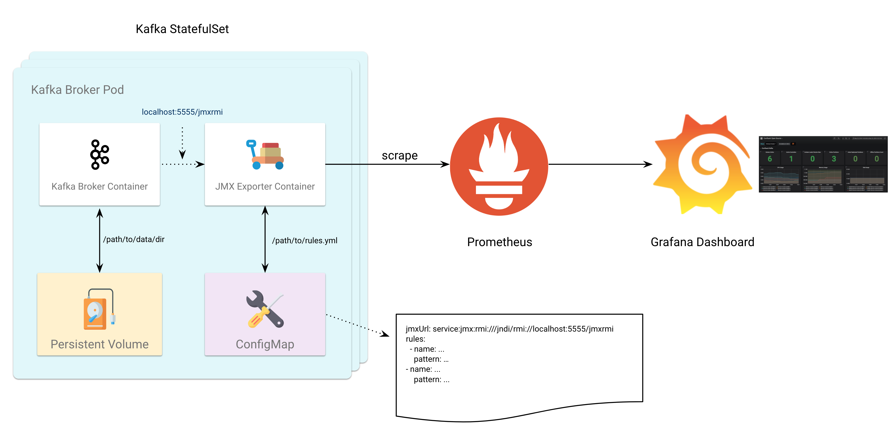

# Monitoring: Sidecar Pattern



[Sidecar Pattern](https://docs.microsoft.com/en-us/azure/architecture/patterns/sidecar) is very useful design for monitoring applications in Kubernetes. By putting a JMX exporter container in the same Pod as Kafka broker container, the JMX metrics can be pulled out directly through `localhost:<port>`.

Below is a snippet of the Kafka StatefulSet definition. As you can see, we declared two containers: `prometheus-jmx-expporter` and `kafka-broker`. A volume is mounted to `kafka-broker` and a [ConfigMap](https://kubernetes.io/docs/tasks/configure-pod-container/configure-pod-configmap/) containing all JMX rules is mounted to `prometheus-jmx-expporter`. `kafka-broker` will expose all jmx metrics through a port\(e.g. 5555\) and `prometheus-jmx-expporter`will get the metrics through `localhost:<jmx port>`, convert the format to prometheus compatible according to the rules defined in ConfigMap\(see example ConfigMap below\).



```yaml
apiVersion: apps/v1beta1
kind: StatefulSet
metadata:
  ...
spec:
  template:
    metadata:
      ...
    spec:
      ...
      containers:
      - name: prometheus-jmx-exporter
        image: ...
        command:
        - java
        - -jar
        - jmx_prometheus_httpserver.jar
        - <JMX port>
        - /etc/jmx-kafka/jmx-kafka-prometheus.yml
        ports:
        - containerPort: ..
        resources:
          ...
        volumeMounts:
        - name: jmx-config
          mountPath: /etc/jmx-kafka
      - name: kafka-broker
        image: ...
        ports:
        - containerPort: <JMX port>
          name: jmx
        ...
        volumeMounts:
        - name: datadir
          mountPath: /opt/kafka/data
      volumes:
      - name: jmx-config
        configMap:
          name: kafka-jmx-configmap
  volumeClaimTemplates:
  - metadata:
      name: datadir
    spec:
      accessModes: [ "ReadWriteOnce" ]
      resources:
        requests:
          storage: <Storage Size>
      storageClassName: <Storage Class Name>
```





```yaml
apiVersion: v1
kind: ConfigMap
metadata:
  name: kafka-jmx-configmap
  ...
data:
  jmx-kafka-prometheus.yml: |+
    jmxUrl: service:jmx:rmi:///jndi/rmi://localhost:<JMX port>/jmxrmi
    lowercaseOutputName: true
    lowercaseOutputLabelNames: true
    ssl: false
    rules:
    - pattern : kafka.server<type=ReplicaManager, name=(.+)><>(Value|OneMinuteRate)
      name: "cp_kafka_server_replicamanager_$1"
    - pattern : kafka.controller<type=KafkaController, name=(.+)><>Value
      name: "cp_kafka_controller_kafkacontroller_$1"
    - pattern : kafka.server<type=BrokerTopicMetrics, name=(.+)><>OneMinuteRate
      name: "cp_kafka_server_brokertopicmetrics_$1"
    - pattern : kafka.network<type=RequestMetrics, name=RequestsPerSec, request=(.+)><>OneMinuteRate
      name: "cp_kafka_network_requestmetrics_requestspersec_$1"
    - pattern : kafka.network<type=SocketServer, name=NetworkProcessorAvgIdlePercent><>Value
      name: "cp_kafka_network_socketserver_networkprocessoravgidlepercent"
    - pattern : kafka.server<type=ReplicaFetcherManager, name=MaxLag, clientId=(.+)><>Value
      name: "cp_kafka_server_replicafetchermanager_maxlag_$1"
    - pattern : kafka.server<type=KafkaRequestHandlerPool, name=RequestHandlerAvgIdlePercent><>OneMinuteRate
      name: "cp_kafka_kafkarequesthandlerpool_requesthandleravgidlepercent"
    - pattern : kafka.controller<type=ControllerStats, name=(.+)><>OneMinuteRate
      name: "cp_kafka_controller_controllerstats_$1"
    - pattern : kafka.server<type=SessionExpireListener, name=(.+)><>OneMinuteRate
      name: "cp_kafka_server_sessionexpirelistener_$1"
```



In order to make Prometheus able to scrape these metrics. We need to add annotations below to Kafka StatefulSet.

```text
      annotations:
        prometheus.io/scrape: "true"
        prometheus.io/port: <JMX exporter container port>
```

