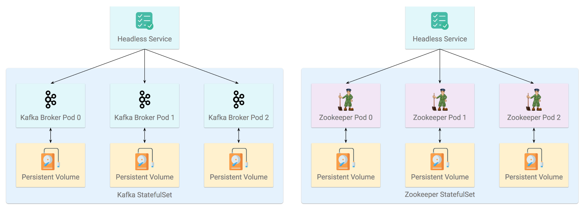

# Cluster: StatefulSet and Headless Service



[StatefulSet](https://kubernetes.io/docs/concepts/workloads/controllers/statefulset/) is the workload API object used to manage stateful applications. It manages the deployment and scaling of a set of [Pods](https://kubernetes.io/docs/concepts/workloads/pods/pod-overview/), and provides guarantees about the ordering and uniqueness of these Pods.

Like a [Deployment](https://kubernetes.io/docs/concepts/workloads/controllers/deployment/), a StatefulSet manages Pods that are based on an identical container spec. Unlike a Deployment, a StatefulSet maintains a sticky identity for each of their Pods. These pods are created from the same spec, but are not interchangeable: each has a persistent identifier that it maintains across any rescheduling.

[Headless Service](https://kubernetes.io/docs/concepts/services-networking/service/#headless-services) is just like normal Kubernetes Services, except they don’t do any load balancing. When combined with StatefulSets, they can give you unique DNS addresses that let you directly access the pods.

Below is an example of StatefulSet YAML  along with a [Headless Service](https://kubernetes.io/docs/concepts/services-networking/service/#headless-services).

```yaml
---
apiVersion: v1
kind: Service
metadata:
  name: <Headless Service Name>
  labels:
    <Labels>
spec:
  ports:
  - port: <Kafka Port>
    name: server
  clusterIP: None
  selector:
    <K,V pair that should match Kafka StatefulSet>
---
apiVersion: apps/v1beta1
kind: StatefulSet
metadata:
  name: <StatefulSet Name>
spec:
  serviceName: <Headless Service Name>
  replicas: <Number of Pods>
  template:
    metadata:
      labels:
        <labels>
    spec:
      containers:
        <Containers Spec>
  volumeClaimTemplates:
  <Persistent Volume Claims>
```


