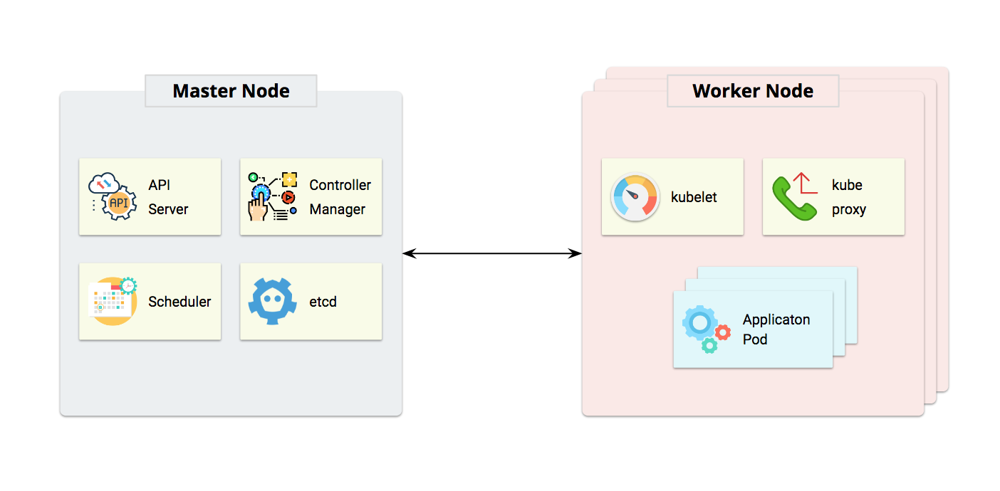

# Architecture

Kubernetes follows a master/worker architecture. **Master Node** is the control plane which contains the components that make global decisions about the cluster, **API server** exposes Kubernetes API, **etcd** is used as the backing store for all cluster data, **controller-manager** is responsible for running all controllers\(Node Controller, Replication Controller, Endpoints Controller, Service Account & Token Controllers, etc\). **Worker Node** is the server where containers are deployed**, kubelet** is an agent running on each worker node and ensures that all containers are running and stay healthy**. kube-proxy** enables the Kubernetes service abstraction by maintaining network rules on the host and performing connection forwarding.

