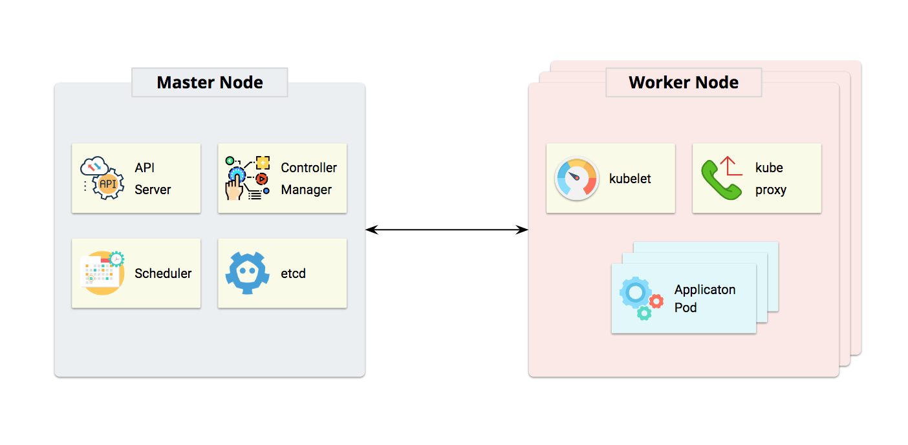

# Architecture

## `Kubernetes`

Kubernetes follows a master/worker architecture. **Master Node** is the control plane which contains the components that make global decisions about the cluster, **API server** exposes Kubernetes API, **etcd** is used as the backing store for all cluster data, **controller-manager **is responsible for running all controllers\(Node Controller, Replication Controller, Endpoints Controller, Service Account & Token Controllers, etc\). **Worker Node** is the server where containers are deployed**, kubelet** is an agent running on each worker node and ensures that all containers are running and stay healthy**. kube-proxy **enables the Kubernetes service abstraction by maintaining network rules on the host and performing connection forwarding.

## Spark

Spark also uses a master/worker architecture. Each Spark application runs independently, the **driver** program is responsible for coordinating/scheduling executors and tasks. When the a Spark application is submitted, the **SparkContext** object in **driver** program will connect to **cluster manager** and ask for **executors**, after executors are assigned, **SparkContext** will send application code and tasks instruction to **executors** for further computation.

## Spark on Kubernetes

When a Spark application is submitted to the **Master Node** of Kubernetes cluster, a **driver pod** will be created first. Once the **driver** **pod** is up and running, it will communicate back to **Master Node** and asks for **executor pods** creation, once the **executor pods** are created, they will communicate with driver pod and start accepting **tasks**.

