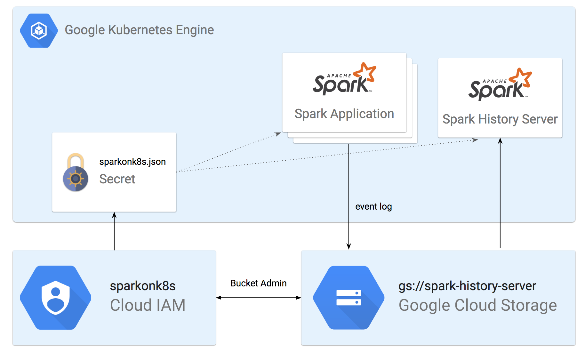

# Basic tryout: Running Spark on Kubernetes

In this example, we are going to deploy a Spark 2.4 environment on top of [Google Kubernetes Engine](https://cloud.google.com/kubernetes-engine/), similarly, you can try it with any Kubernetes Service you would like to such as [Amazon EKS](https://aws.amazon.com/eks/), [Azure Container Service](https://azure.microsoft.com/en-us/services/container-service/), [Pivotal Container Service](https://pivotal.io/platform/pivotal-container-service), etc.

Since Spark 2.4 has Kubernetes as a native support, there's almost nothing else to setup. Once Kubernetes cluster is up, it's ready to accept Spark Jobs. The only thing we need to set up is Spark History Server, which allows users to view the completed job logs.

## 

###  

