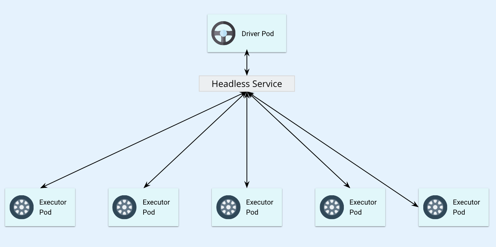
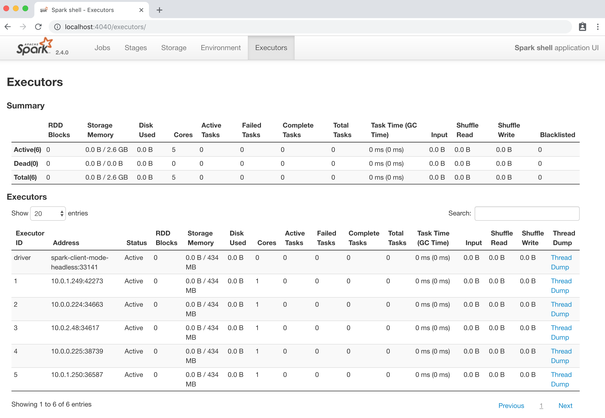

# Client Mode: spark-shell, pyspark, sparkR



Starting from 2.4.0, Spark supports client mode for Kubernetes cluster backend , which allows users to run interactive tools such as spark-shell or notebooks **in a pod running in a Kubernetes cluster** or **on a client machine outside a cluster.**

 **Note:** Users need to set up network connectivity properly in either case. The example we show below is to run `spark-shell`,`pyspark`,`sparkR` in a pod in Kubernetes and leverages [Headless Service](https://kubernetes.io/docs/concepts/services-networking/service/#headless-services) to allow driver to be routable for executors to connect with a stable FQDN. For client outside k8s cluster, users need to make sure that all executors in cluster can reach the driver.

Below is the yaml for an idle spark Pod in Kubernetes cluster as a "client" where we'll run `spark-shell` ,  and a Headless Service to provide a stable FQDN. According to Spark 2.4 [documentation](https://spark.apache.org/docs/latest/running-on-kubernetes.html#client-mode). It is recommended to assign your driver pod a sufficiently unique label and to use that label in the label selector of the headless service. 



```yaml
apiVersion: apps/v1

kind: Deployment
metadata:
  name: spark-client-mode-deployment
  labels:
    app: spark-client-mode-driver
spec:
  replicas: 1
  selector:
    matchLabels:
      app: spark-client-mode-driver
  template:
    metadata:
      labels:
        app: spark-client-mode-driver
    spec:
      serviceAccountName: spark
      containers:
      - name: spark-client-mode-driver
        image: azureq/pantheon:spark-2.4
        command: [ "/bin/bash", "-c", "--" ]
        args: [ "while true; do sleep 30; done;" ]
        ports:
        - containerPort: 7078
        - containerPort: 7079
        - containerPort: 4040
        volumeMounts:
        - name: sparklogs-secrets
          mountPath: "/etc/secrets"
          readOnly: true
      volumes:
        - name: sparklogs-secrets
          secret:
            secretName: sparklogs
---
kind: Service
apiVersion: v1
metadata:
  name: spark-client-mode-headless
spec:
  clusterIP: None
  selector:
    app: spark-client-mode-driver
  ports:
  - name: driver-rpc-port
    protocol: TCP
    port: 7078
    targetPort: 7078
  - name: blockmanager
    protocol: TCP
    port: 7079
    targetPort: 7079
```



Deploy the yaml file and check the status of the idle "client" Pod. 

```bash
$ kubectl apply -f client-mode-pod-spark.yaml
deployment.apps/spark-client-mode-deployment created
service/spark-client-mode-headless created

$ kubectl get pods
NAME                                               READY   STATUS    RESTARTS   AGE
spark-client-mode-deployment-bb694bdf8-jglh7       1/1     Running   0          17m
spark-history-server-deployment-6477dc8b88-fxt2q   1/1     Running   0          5h

$ kubectl exec -it spark-client-mode-deployment-bb694bdf8-jglh7 -- /bin/bash
```

Once it's ready we can log into that Pod and run `spark-shell`. Comparing to `spark-submit`, there's no big difference besides two extra parameters: `spark.driver.host` and `spark.driver.pod.name`. These parameters will make executor Pods get deployed with [OwnerReference](https://kubernetes.io/docs/concepts/workloads/controllers/garbage-collection/), which ensure that executor Pods will be deleted once driver shuts down or is deleted. More details [here](https://spark.apache.org/docs/latest/running-on-kubernetes.html#client-mode-executor-pod-garbage-collection)

```text
$ bash-4.4# $SPARK_HOME/bin/spark-shell \
>     --master k8s://https://$KUBERNETES_SERVICE_HOST:$KUBERNETES_SERVICE_PORT_HTTPS \
>     --deploy-mode client \
>         --conf spark.eventLog.enabled=true \
>     --conf spark.eventLog.dir=gs://spark-history-server/ \
>     --conf spark.executor.instances=5 \
>     --conf spark.kubernetes.container.image=azureq/pantheon:spark-2.4 \
>     --conf spark.kubernetes.authenticate.driver.serviceAccountName=spark \
>     --conf spark.hadoop.google.cloud.auth.service.account.json.keyfile=/etc/secrets/sparkonk8s.json \
>     --conf spark.kubernetes.driver.secrets.sparklogs=/etc/secrets \
>     --conf spark.kubernetes.executor.secrets.sparklogs=/etc/secrets \
>     --conf spark.driver.host=spark-client-mode-headless \
>     --conf spark.driver.pod.name=spark-client-mode-headless

To adjust logging level use sc.setLogLevel(newLevel). For SparkR, use setLogLevel(newLevel).
2018-11-14 21:10:33 WARN  GoogleHadoopFileSystemBase:76 - No working directory configured, using default: 'gs://spark-history-server/'
Spark context Web UI available at http://spark-client-mode-headless:4040
Spark context available as 'sc' (master = k8s://https://10.3.240.1:443, app id = spark-application-1542229831701).
Spark session available as 'spark'.
Welcome to
      ____              __
     / __/__  ___ _____/ /__
    _\ \/ _ \/ _ `/ __/  '_/
   /___/ .__/\_,_/_/ /_/\_\   version 2.4.0
      /_/

Using Scala version 2.11.12 (OpenJDK 64-Bit Server VM, Java 1.8.0_181)
Type in expressions to have them evaluated.
Type :help for more information.

scala>
```

To view driver's UI, we can port forward the Pod's 4040 to local and visit [http://localhost:4040](http://localhost:4040).

```text
kubectl port-forward spark-client-mode-deployment-bb694bdf8-jglh7 4040:4040
```




## More Examples: pyspark, sparkR

Create a pod with image `azureq/pantheon:pyspark-2.4`using previous `spark-client-mode-pod.yaml` and run `pyspark`in it.

```text
$ bin/pyspark \
    --master k8s://https://$KUBERNETES_SERVICE_HOST:$KUBERNETES_SERVICE_PORT_HTTPS \
    --deploy-mode client \
    --conf spark.eventLog.enabled=true \
    --conf spark.eventLog.dir=gs://spark-history-server/ \
    --conf spark.executor.instances=5 \
    --conf spark.kubernetes.container.image=azureq/pantheon:pyspark-2.4 \
    --conf spark.kubernetes.authenticate.driver.serviceAccountName=spark \
    --conf spark.hadoop.google.cloud.auth.service.account.json.keyfile=/etc/secrets/sparkonk8s.json \
    --conf spark.kubernetes.driver.secrets.sparklogs=/etc/secrets \
    --conf spark.kubernetes.executor.secrets.sparklogs=/etc/secrets \
    --conf spark.driver.host=spark-client-mode-headless \
    --conf spark.driver.pod.name=spark-client-mode-headless
```

Create a pod with image `azureq/pantheon:rspark-2.4`using previous `spark-client-mode-pod.yaml` and run `sparkR`in it.

```text
$ bin/sparkR\
    --master k8s://https://$KUBERNETES_SERVICE_HOST:$KUBERNETES_SERVICE_PORT_HTTPS \
    --deploy-mode client \
    --conf spark.eventLog.enabled=true \
    --conf spark.eventLog.dir=gs://spark-history-server/ \
    --conf spark.executor.instances=5 \
    --conf spark.kubernetes.container.image=azureq/pantheon:rspark-2.4 \
    --conf spark.kubernetes.authenticate.driver.serviceAccountName=spark \
    --conf spark.hadoop.google.cloud.auth.service.account.json.keyfile=/etc/secrets/sparkonk8s.json \
    --conf spark.kubernetes.driver.secrets.sparklogs=/etc/secrets \
    --conf spark.kubernetes.executor.secrets.sparklogs=/etc/secrets \
    --conf spark.driver.host=spark-client-mode-headless \
    --conf spark.driver.pod.name=spark-client-mode-headless
```

