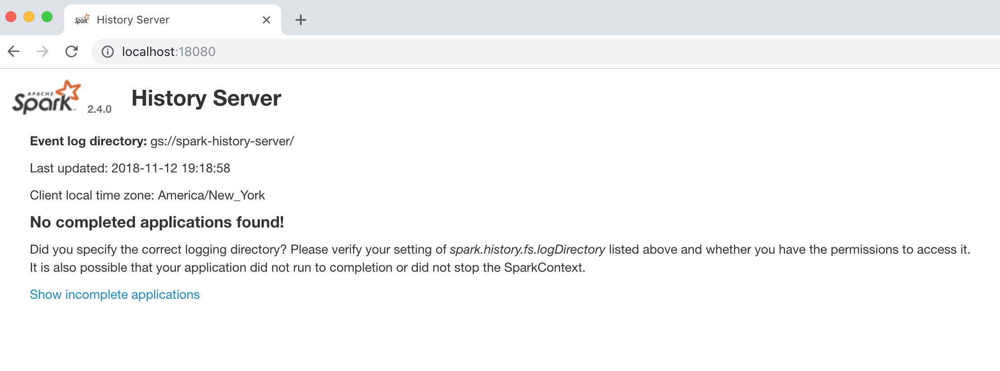

# Setup Spark History Server

## Deploy Spark History Server On GKE with GCS as the backend storage

**Spark History Server** is the Web UI for Spark applications and allow users to [view after the fact](https://spark.apache.org/docs/latest/monitoring.html#viewing-after-the-fact), Spark applications should be configured to log events to a directory which Spark History Server will read from to construct the visualization. The directory can be a **local file path**, **an HDFS path**, or **any alternative file system supported by Hadoop APIs**. In this example, we'll use [Google Cloud Storage](https://cloud.google.com/storage/) as the backend storage since we are running a Google Kubernetes Engine cluster, you may also use [Amazon S3](https://aws.amazon.com/s3/), [Azure Blob Storage](https://azure.microsoft.com/en-us/services/storage/blobs/), etc.

Setup [gsutil](https://cloud.google.com/storage/docs/gsutil) and [gcloud](https://cloud.google.com/sdk/) on your local laptop and associate them with your GCP project, create a bucket, create an [IAM service account](https://cloud.google.com/iam/docs/service-accounts) _**sparkonk8s**_, generate a json key file _**sparkonk8s.json**_, to grant _**sparkonk8s**_ admin permission to bucket _**gs://spark-history-server.**_

```text
$ gsutil mb -c nearline gs://spark-history-server
$ export ACCOUNT_NAME=sparkonk8s
$ export GCP_PROJECT_ID=qshao
$ gcloud iam service-accounts create ${ACCOUNT_NAME} --display-name "${ACCOUNT_NAME}"
$ gcloud iam service-accounts keys create "${ACCOUNT_NAME}.json" --iam-account "${ACCOUNT_NAME}@${GCP_PROJECT_ID}.iam.gserviceaccount.com"
$ gcloud projects add-iam-policy-binding ${GCP_PROJECT_ID} --member "serviceAccount:${ACCOUNT_NAME}@${GCP_PROJECT_ID}.iam.gserviceaccount.com" --role roles/storage.admin
$ gsutil iam ch serviceAccount:${ACCOUNT_NAME}@${GCP_PROJECT_ID}.iam.gserviceaccount.com:objectAdmin gs://spark-history-server
```

Create [Kubernetes Secrets ](https://kubernetes.io/docs/concepts/configuration/secret/)with _**sparkonk8s.json**_, which will be mounted to Spark Application Pods and Spark History Server Pod later in order to enable them to write/read from _**gs://spark-history-server.**_

```text
$ kubectl create secret generic sparklogs --from-file=/Path/to/sparkonk8s.json
$ kubectl describe secret sparklogs
Name:         sparklogs
Namespace:    default
Labels:       <none>
Annotations:  <none>

Type:  Opaque

Data
====
sparkonk8s.json:  2302 bytes
```

Next, we are going to construct the yml file for deploying a Spark History Server Pod, as you can see in the yml file, we created a [Deployment](https://kubernetes.io/docs/concepts/workloads/controllers/deployment/) with previously created Spark docker image _**azureq/pantheon:spark-2.4**_, mounted GCS Service Account Secret _**sparkonk8s.json**_ to the Pod, configured the GCS bucket _**gs://spark-history-server**_ as the log directory. Also, we created a [Service](https://kubernetes.io/docs/concepts/services-networking/service/) to allow remote access.

```yaml
kind: Deployment
apiVersion: apps/v1beta1
metadata:
  name: spark-history-server-deployment
spec:
  replicas: 1
  selector:
    matchLabels:
      component: spark-history-server
  template:
    metadata:
      labels:
        component: spark-history-server
    spec:
      containers:
        - name: spark-history-server
          image: azureq/pantheon:spark-2.4
          env:
          - name: SPARK_HISTORY_OPTS
            value: "-Dspark.hadoop.google.cloud.auth.service.account.json.keyfile=/etc/secrets/sparkonk8s.json"
          command: ["/opt/spark/bin/spark-class","org.apache.spark.deploy.history.HistoryServer","gs://spark-history-server/"]
          ports:
            - containerPort: 18080
          resources:
            requests:
              cpu: "1"
              memory: "1024Mi"
          volumeMounts:
          - name: sparklogs-secrets
            mountPath: "/etc/secrets"
            readOnly: true
      volumes:
      - name: sparklogs-secrets
        secret:
          secretName: sparklogs
---
kind: Service
apiVersion: v1
metadata:
  name: spark-history-server
spec:
  type: LoadBalancer
  ports:
    - port: 18080
      targetPort: 18080
      name: history
  selector:
    component: spark-history-server
```

Now, we can deploy Spark History Server Pod on GKE cluster.

```text
$ kubectl create -f spark-history-server.yaml
deployment "spark-history-server-deployment" created
service "spark-history-server" created
```

To access the UI of Spark History Server, we can get the Pod name, use **kubectl port-forward** to forward port 18080 on the local workstation to port 18080 of Spark History Server Pod, then access [http://localhost:18080](http://localhost:18080) in your browser.

```text
$ kubectl get pods
NAME                                               READY     STATUS    RESTARTS   AGE
spark-history-server-deployment-6477dc8b88-bqm7b   1/1       Running   0          8m

$ kubectl port-forward spark-history-server-deployment-6477dc8b88-bqm7b 18080:18080
Forwarding from 127.0.0.1:18080 -> 18080
Handling connection for 18080
```



