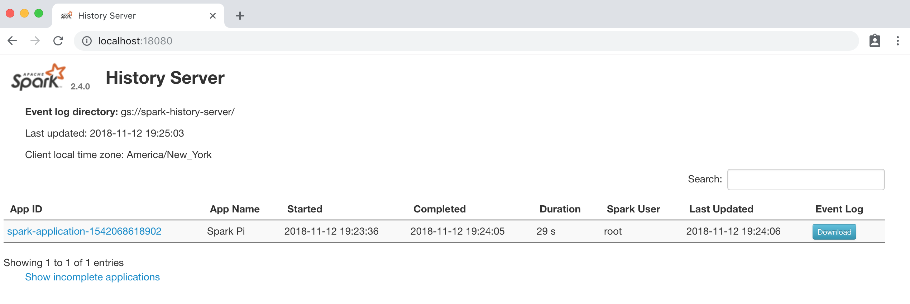
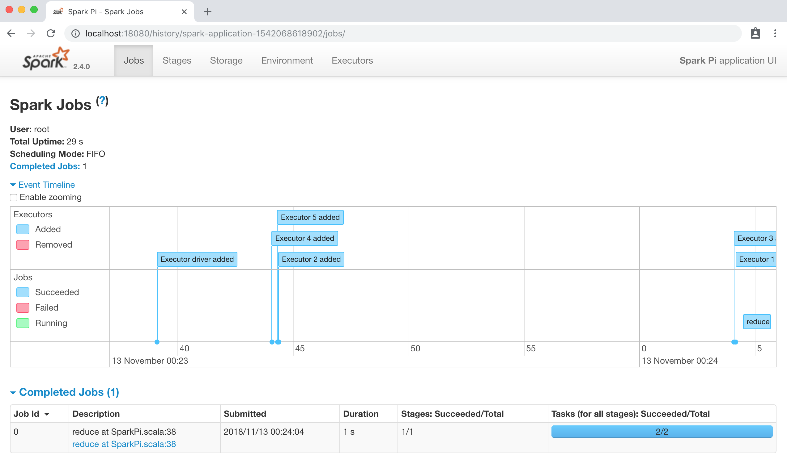

# Cluster Mode: spark-submit

## Submit a Spark Job with event logging enabled and log events to GCS bucket

Now, we can submit a Spark Job to the GKE cluster and view logs after it's finished. As we see in [Architecture](/chapter1/architecture.md), Spark driver Pod will request executor Pods from Kubernetes Master\(API Server to be specific\), it needs a service account with proper permission. We will create a Service Account _**spark**_, bind it with a **edit ClusterRole** and specify it when submitting the job.

Please refer to the official [Running Spark On Kubernetes](https://spark.apache.org/docs/latest/running-on-kubernetes.html) Doc for detailed explanation of all the parameters.

```text
$ kubectl create serviceaccount spark
serviceaccount "spark" created
$ kubectl create clusterrolebinding spark-role --clusterrole=edit --serviceaccount=default:spark --namespace=default
clusterrolebinding "spark-role" created
$ cd spark-2.4.0-bin-hadoop2.7
$ bin/spark-submit \
    --master k8s://https://<Your Kubernetes Master's IP> \
    --deploy-mode cluster \
    --name spark-pi \
    --class org.apache.spark.examples.SparkPi \
    --conf spark.eventLog.enabled=true \
    --conf spark.eventLog.dir=gs://spark-history-server/ \
    --conf spark.executor.instances=5 \
    --conf spark.kubernetes.container.image=azureq/pantheon:spark-2.4 \
    --conf spark.kubernetes.authenticate.driver.serviceAccountName=spark \
    --conf spark.hadoop.google.cloud.auth.service.account.json.keyfile=/etc/secrets/sparkonk8s.json \
    --conf spark.kubernetes.driver.secrets.sparklogs=/etc/secrets \
    --conf spark.kubernetes.executor.secrets.sparklogs=/etc/secrets \
    local:///opt/spark/examples/jars/spark-examples_2.11-2.4.0.jar
```

After the Job finished, you'll be able to see its event logs in Spark History Server by accessing [http://localhost:18080](http://localhost:18080) \(don't forget port forwarding\).





## More Examples: Submitting Python, R jobs

Submitting a Python job using Docker image built before: `azureq/pantheon:pyspark-2.4`

```text
$ bin/spark-submit \
    --master k8s://https://<Kubernetes Master> \
    --deploy-mode cluster \
    --name pyspark-example \
    --conf spark.eventLog.enabled=true \
    --conf spark.eventLog.dir=gs://spark-history-server/ \
    --conf spark.executor.instances=5 \
    --conf spark.kubernetes.container.image=azureq/pantheon:pyspark-2.4 \
    --conf spark.kubernetes.authenticate.driver.serviceAccountName=spark \
    --conf spark.hadoop.google.cloud.auth.service.account.json.keyfile=/etc/secrets/sparkonk8s.json \
    --conf spark.kubernetes.driver.secrets.sparklogs=/etc/secrets \
    --conf spark.kubernetes.executor.secrets.sparklogs=/etc/secrets \
    local:///opt/spark/examples/src/main/python/pi.py \
    100
```

Submitting an R job using Docker image built before: `azureq/pantheon:rspark-2.4`

```text
$ bin/spark-submit \
    --master k8s://https://<Kubernetes Master> \
    --deploy-mode cluster \
    --name rspark-example \
    --conf spark.eventLog.enabled=true \
    --conf spark.eventLog.dir=gs://spark-history-server/ \
    --conf spark.executor.instances=5 \
    --conf spark.kubernetes.container.image=azureq/pantheon:rspark-2.4 \
    --conf spark.kubernetes.authenticate.driver.serviceAccountName=spark \
    --conf spark.hadoop.google.cloud.auth.service.account.json.keyfile=/etc/secrets/sparkonk8s.json \
    --conf spark.kubernetes.driver.secrets.sparklogs=/etc/secrets \
    --conf spark.kubernetes.executor.secrets.sparklogs=/etc/secrets \
    local:///opt/spark/examples/src/main/r/dataframe.R
```

