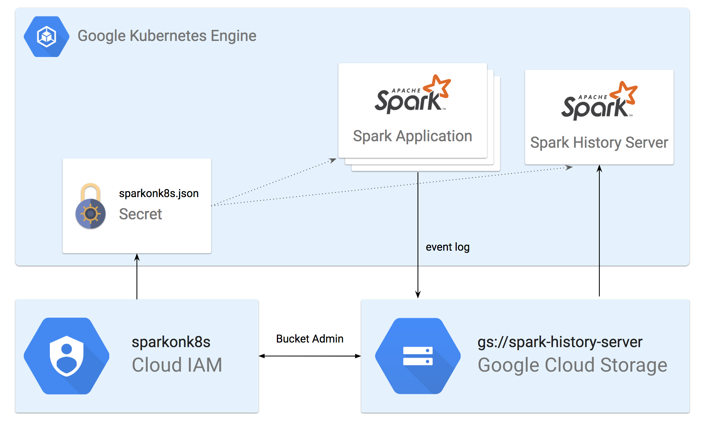

# Example: Running Spark on Kubernetes

## Running Spark on Google Kubernetes Engine

In this example, we are going to deploy a Spark 2.3 environment on top of [Google Kubernetes Engine](https://cloud.google.com/kubernetes-engine/), similarly, you can try it with any Kubernetes Service you would like to such as [Amazon EKS](https://aws.amazon.com/eks/), [Azure Container Service](https://azure.microsoft.com/en-us/services/container-service/), [Pivotal Container Service](https://pivotal.io/platform/pivotal-container-service), etc.

Since Spark 2.3 has Kubernetes as a native support, there's almost nothing else to setup. Once Kubernetes cluster is up, it's ready to accept Spark Jobs. The only thing we need to set up is Spark History Server, which allows users to view the completed job logs.



## Steps

### 1. Create Google Kubernetes Engine

Please refer to the [Quickstart](https://cloud.google.com/kubernetes-engine/docs/quickstart) Guide about how to create a GKE cluster, get authentication credentials for the cluster and use **kubectl** command line tool.

### 2. Prepare Spark 2.3

Download Spark 2.3 from [Apache Spark website](https://spark.apache.org/downloads.html)

```text
$ curl -O http://apache.mirrors.lucidnetworks.net/spark/spark-2.3.0/spark-2.3.0-bin-hadoop2.7.tgz
$ tar -zxvf spark-2.3.0-bin-hadoop2.7.tgz
$ ls spark-2.3.0-bin-hadoop2.7
LICENSE    README.md  conf       jars       python
NOTICE     RELEASE    data       kubernetes sbin
R          bin        examples   licenses   yarn
```

Download [Google Cloud Storage Connector for Hadoop 2.x](https://cloud.google.com/dataproc/docs/concepts/connectors/cloud-storage), [Hadoop AWS 2.7.x](https://mvnrepository.com/artifact/org.apache.hadoop/hadoop-aws/2.7.3) and [AWS SDK for Java](https://aws.amazon.com/sdk-for-java/), copy the jar files to _**jars/**_ in Spark, these are the dependency jar files in order to leverage [Google Cloud Storage](https://cloud.google.com/storage/) and [Amazon S3](https://aws.amazon.com/s3/) as the data/log store.

```text
$ curl -O https://storage.googleapis.com/hadoop-lib/gcs/gcs-connector-latest-hadoop2.jar
$ curl -O http://central.maven.org/maven2/org/apache/hadoop/hadoop-aws/2.7.3/hadoop-aws-2.7.3.jar
$ curl -O https://sdk-for-java.amazonwebservices.com/latest/aws-java-sdk.zip
$ unzip aws-java-sdk.zip
$ cp gcs-connector-latest-hadoop2.jar hadoop-aws-2.7.3.jar aws-java-sdk-1.11.292/lib/aws-java-sdk-1.11.292.jar spark-2.3.0-bin-hadoop2.7/jars/
```

Build Spark 2.3 Docker Image, Spark 2.3 provides a dockerfile which we can use directly to build docker images. Please refer to [Docker Doc](https://docs.docker.com/) about how to install docker on your local laptop and Create Docker ID. Once the image is built, we need to push it to Docker Registry such as [Docker Hub](https://hub.docker.com/), [Google Container Registry](https://cloud.google.com/container-registry/), [Harbor](https://github.com/vmware/harbor), etc.

```text
$ cd spark-2.3.0-bin-hadoop2.7
$ docker build -f ./kubernetes/dockerfiles/spark/Dockerfile . -t azureq/pantheon:spark-2.3
$ docker push azureq/pantheon:spark-2.3
```

Now you have a Spark 2.3 docker image with GCS and Amazon S3 connector built in.

### 2. Deploy Spark History Server On GKE with GCS as the backend storage

**Spark History Server** is the Web UI for Spark applications and allow users to [view after the fact](https://spark.apache.org/docs/latest/monitoring.html#viewing-after-the-fact), Spark applications should be configured to log events to a directory which Spark History Server will read from to construct the visualization. The directory can be a **local file path**, **an HDFS path**, or **any alternative file system supported by Hadoop APIs**. In this example, we'll use [Google Cloud Storage](https://cloud.google.com/storage/) as the backend storage since we are running a Google Kubernetes Engine cluster, you may also use [Amazon S3](https://aws.amazon.com/s3/), [Azure Blob Storage](https://azure.microsoft.com/en-us/services/storage/blobs/), etc.

Setup [gsutil](https://cloud.google.com/storage/docs/gsutil) and [gcloud](https://cloud.google.com/sdk/) on your local laptop and associate them with your GCP project, create a bucket, create an [IAM service account](https://cloud.google.com/iam/docs/service-accounts) _**sparkonk8s**_, generate a json key file _**sparkonk8s.json**_, to grant _**sparkonk8s**_ admin permission to bucket _**gs://spark-history-server.**_

```text
$ gsutil mb -c nearline gs://spark-history-server
$ export ACCOUNT_NAME=sparkonk8s
$ export GCP_PROJECT_ID=qshao
$ gcloud iam service-accounts create ${ACCOUNT_NAME} --display-name "${ACCOUNT_NAME}"
$ gcloud iam service-accounts keys create "${ACCOUNT_NAME}.json" --iam-account "${ACCOUNT_NAME}@${GCP_PROJECT_ID}.iam.gserviceaccount.com"
$ gcloud projects add-iam-policy-binding ${GCP_PROJECT_ID} --member "serviceAccount:${ACCOUNT_NAME}@${GCP_PROJECT_ID}.iam.gserviceaccount.com" --role roles/storage.admin
$ gsutil iam ch serviceAccount:${ACCOUNT_NAME}@${GCP_PROJECT_ID}.iam.gserviceaccount.com:objectAdmin gs://spark-history-server
```

Create [Kubernetes Secrets ](https://kubernetes.io/docs/concepts/configuration/secret/)with _**sparkonk8s.json**_, which will be mounted to Spark Application Pods and Spark History Server Pod later in order to enable them to write/read from _**gs://spark-history-server.**_

```text
$ kubectl create secret generic sparklogs --from-file=/Path/to/sparkonk8s.json
$ kubectl describe secret sparklogs
Name:         sparklogs
Namespace:    default
Labels:       <none>
Annotations:  <none>

Type:  Opaque

Data
====
sparkonk8s.json:  2309 bytes
```

Next, we are going to construct the yml file for deploying a Spark History Server Pod, as you can see in the yml file, we created a [Deployment](https://kubernetes.io/docs/concepts/workloads/controllers/deployment/) with previously created Spark docker image _**azureq/pantheon:spark-2.3**_, mounted GCS Service Account Secret _**sparkonk8s.json**_ to the Pod, configured the GCS bucket _**gs://spark-history-server**_ as the log directory. Also, we created a [Service](https://kubernetes.io/docs/concepts/services-networking/service/) to allow remote access.

```text
kind: Deployment
apiVersion: apps/v1beta1
metadata:
  name: spark-history-server-deployment
spec:
  replicas: 1
  selector:
    matchLabels:
      component: spark-history-server
  template:
    metadata:
      labels:
        component: spark-history-server
    spec:
      containers:
        - name: spark-history-server
          image: azureq/pantheon:spark-2.3
          env:
          - name: SPARK_HISTORY_OPTS
            value: "-Dspark.hadoop.google.cloud.auth.service.account.json.keyfile=/etc/secrets/sparkonk8s.json"
          command: ["/opt/spark/bin/spark-class","org.apache.spark.deploy.history.HistoryServer","gs://spark-history-server/"]
          ports:
            - containerPort: 18080
          resources:
            requests:
              cpu: "1"
              memory: "1024Mi"
          volumeMounts:
          - name: sparklogs-secrets
            mountPath: "/etc/secrets"
            readOnly: true
      volumes:
      - name: sparklogs-secrets
        secret:
          secretName: sparklogs
---
kind: Service
apiVersion: v1
metadata:
  name: spark-history-server
spec:
  type: NodePort
  ports:
    - port: 18080
      targetPort: 18080
      name: history
  selector:
    component: spark-history-server
```

Now, we can deploy Spark History Server Pod on GKE cluster.

```text
$ kubectl create -f spark-history-server.yml
deployment "spark-history-server-deployment" created
service "spark-history-server" created
```

To access the UI of Spark History Server, we can get the Pod name, use **kubectl port-forward** to forward port 18080 on the local workstation to port 18080 of Spark History Server Pod, then access [http://localhost:18080](http://localhost:18080) in your browser.

```text
$ kubectl get pods
NAME                                               READY     STATUS    RESTARTS   AGE
spark-history-server-deployment-59f65cbf5b-64tgw   1/1       Running   0          8m
$ kubectl port-forward spark-history-server-deployment-59f65cbf5b-64tgw 18080:18080
Forwarding from 127.0.0.1:18080 -> 18080
Handling connection for 18080
```


### 3. Submit a Spark Job with event logging enabled and log events to GCS bucket

Now, we can submit a Spark Job to the GKE cluster and view logs after it's finished. As we see in [Architecture](/chapter1/architecture.md), Spark driver Pod will request executor Pods from Kubernetes Master\(API Server to be specific\), it needs a service account with proper permission. We will create a Service Account _**spark**_, bind it with a **edit ClusterRole** and specify it when submitting the job.

Please refer to the official [Running Spark On Kubernetes](https://spark.apache.org/docs/latest/running-on-kubernetes.html) Doc for detailed explanation of all the parameters.

```text
$ kubectl create serviceaccount spark
serviceaccount "spark" created
$ kubectl create clusterrolebinding spark-role --clusterrole=edit --serviceaccount=default:spark --namespace=default
clusterrolebinding "spark-role" created
$ cd spark-2.3.0-bin-hadoop2.7
$ bin/spark-submit \
    --master k8s://https://<Your Kubernetes Master's IP> \
    --deploy-mode cluster \
    --name spark-pi \
    --class org.apache.spark.examples.SparkPi \
    --conf spark.eventLog.enabled=true \
    --conf spark.eventLog.dir=gs://spark-history-server/ \
    --conf spark.executor.instances=5 \
    --conf spark.kubernetes.container.image=azureq/pantheon:spark-2.3 \
    --conf spark.kubernetes.authenticate.driver.serviceAccountName=spark \
    --conf spark.hadoop.google.cloud.auth.service.account.json.keyfile=/etc/secrets/sparkonk8s.json \
    --conf spark.kubernetes.driver.secrets.sparklogs=/etc/secrets \
    --conf spark.kubernetes.executor.secrets.sparklogs=/etc/secrets \
    local:///opt/spark/examples/jars/spark-examples_2.11-2.3.0.jar
```

After the Job finished, you'll be able to see its event logs in Spark History Server by accessing [http://localhost:18080](http://localhost:18080) \(don't forget port forwarding\).


